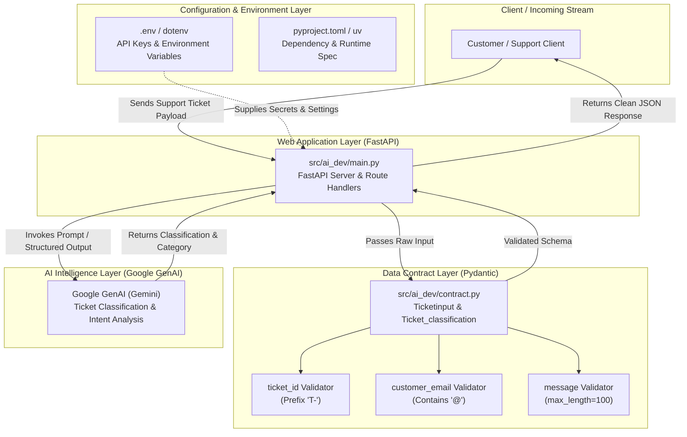

# Project Architecture: AI-Dev (Intelligent Ticket Classification System)

---

## 1. High-Level Architectural Overview

`AI-Dev` is an intelligent, automated support ticket intake and classification service. The platform is designed around a modern, decoupled Python stack that receives customer support tickets, enforces strict structural and semantic validation (Data Contracts), and will leverage Google's Generative AI (Gemini) to categorize issues, detect urgency, and prepare tickets for resolution.

---

## 2. Architectural Layers & Components

The application follows a **Separation of Concerns (SoC)** layered pattern:

1. **Configuration & Environment Layer (`.env`, `pyproject.toml`, `.python-version`)**:
   - Manages runtime requirements (Python 3.14+), isolated packaging via `uv`, and secure ingestion of environment variables such as the Gemini API key without hardcoding credentials into source control.

2. **Web & Routing Layer (`src/ai_dev/main.py`)**:
   - Acts as the primary HTTP gateway using `FastAPI`.
   - Responsible for accepting incoming requests, managing the application lifecycle, serving endpoints, and orchestrating calls between the data models and the external AI service.

3. **Data Contract & Validation Layer (`src/ai_dev/contract.py`)**:
   - Establishes a strictly typed boundary between untrusted external data and internal services using `Pydantic`.
   - Rejects malformed tickets at the system gate before costly computational resources or AI token quotas are spent.
   - Enforces specific business rules (e.g., ticket ID prefixing, email address formatting, message size ceilings, and timestamp parsing).

4. **AI & Intelligence Service Layer (`google-genai` integration)**:
   - Interfaces with Google Gemini to read user messages, determine ticket severity/category (e.g., Technical, Billing, General Inquiry), and produce structured classifications.

---

## 3. Data Processing Flow

1. **Intake**: An external client or customer submits a ticket containing an ID, email, message, and timestamp.
2. **Contract Verification**: Pydantic models in `contract.py` intercept the payload. If validation rules fail (e.g., missing `@` in email or message over 100 characters), an explicit error is returned immediately.
3. **AI Inference**: The validated ticket data is handed to the Google GenAI client in `main.py`.
4. **Structured Classification**: Gemini determines the category and metadata, mapped to `Ticket_classification`.
5. **Egress**: A standardized, structured JSON response is emitted back to the client.

---

## 4. File-by-File Matrix (One-Liner Explanations)

| File Path | One-Liner Purpose |
| :--- | :--- |
| **`pyproject.toml`** | Defines project metadata, build configurations, scripts, and package dependencies (`fastapi`, `pydantic`, `dotenv`). |
| **`uv.lock`** | Locks the exact versions, hashes, and dependency tree to guarantee reproducible builds across all machines. |
| **`.python-version`** | Specifies the exact Python runtime version (`3.14`) targeted by the local virtual environment and package manager. |
| **`.env`** | Stores local secret configuration values and API keys (such as `GEMINI_API_KEY`) away from public version control. |
| **`.gitignore`** | Instructs Git which build artifacts, virtual environments (`.venv`), cache files, and private secrets to ignore. |
| **`README.md`** | Serves as the introductory landing documentation explaining project purpose, setup instructions, and usage. |
| **`src/ai_dev/__init__.py`** | Marks the directory as an importable Python package and defines the default CLI execution entrypoint. |
| **`src/ai_dev/contract.py`** | Declares Pydantic data models and custom validation rules that govern the structure of incoming tickets and outgoing classifications. |
| **`src/ai_dev/main.py`** | Initializes the FastAPI application, loads environment variables, imports the Google GenAI SDK, and serves as the primary application engine. |
| **`Progress/architecture.md`** | Documents the system architecture, component relationships, data lifecycle, and directory-wide file duties. |
| **`Progress/summary.md`** | Provides an exhaustive, beginner-friendly walkthrough of all code with deep conceptual breakdowns of every technical term. |
